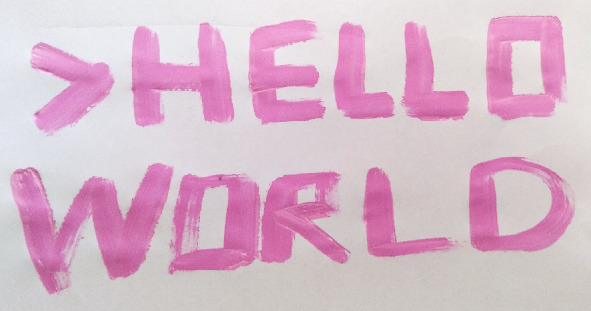
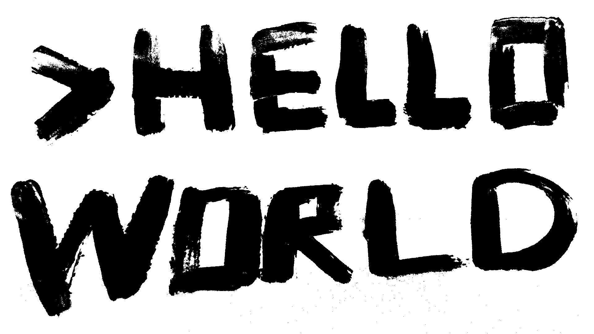

# Hello-World-Artwork

Video exploration taking to the limits the question of what is the relationship between electronic artworks and literature, and if they can even be called that.

Artwork created by:

    Author: Sergio Luis Beleño Díaz
    Date: 2020-10-12

## First step

I made a painting writing ">HELLO WORLD" on a piece of paper and I took a photo of the painting.

## Second step 

I made a binarization of the image to get the texture of the image in black and white with the BINSergio.py code file.

## Third step

I created a video with a text background in a loop "Hello World By Sergio Beleño" with the HelloWorld.py code file.

## Fourth step

I created the final video adding an intro and overlapping the image with the loop video.

